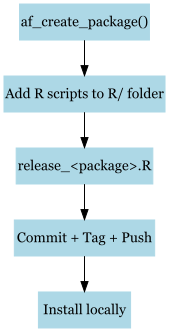

<!-- README.md is generated from README.Rmd. Please edit that file -->

# afcommon Package

<!-- badges: start -->

<!-- badges: end -->

`afcommon` contains utility functions to automate R package creation and
release workflows.

## Installation

You can install the development version of afcommon from
[GitHub](https://github.com/) with:

devtools::install_github(“amirhome61/afcommon”) library(afcommon)

## Workflow Overview

1.  **Create a new package** using `af_create_package()`.
2.  **Add your R scripts** to the `R/` folder of the new package.
3.  **Run the release script** (`release_<package>.R`) to:
    - Increment the version (or use initial version)
    - Update documentation via roxygen2
    - Commit changes to Git
    - Tag the release
    - Push to GitHub
    - Install the package locally

<figure>

<figcaption aria-hidden="true">Workflow Diagram</figcaption>
</figure>
